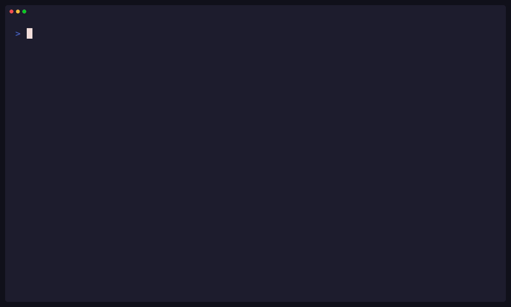

gitpr reviews worktree branches inside a local Git repository. Pull request
metadata, review-event commit pins, thread-anchor pins, and state indexes live
under `refs/gitpr/`, so linked worktrees and clones share the same records
without a server or working-tree data directory.

## Review model

A pull request binds a source branch to a base branch. The record follows those
branches while work changes; it does not freeze head commits or store a diff.
`review` resolves the live heads and computes the diff when requested.

Approve and reject append immutable review events. Each event identifies the
exact source head, base head, merge base, verdict, timestamp, and preceding
event. Approval is separate from merge: approval records a judgment, while merge
requires the latest event to be accepted, both live heads to remain equal to the
reviewed pair, and the reviewed history to be a strict fast-forward.

Threads attach to a file range in a reviewed head pair or to the PR as a whole.
Anchored ranges move with unchanged content and remain visible as outdated when
their content cannot be mapped. Comments remain available after closure and
record when they were written post-closure.

An open PR ends as merged or as closed with an integrated, superseded, or
abandoned reason and structured evidence. Terminal records remain retained until
an explicit forced deletion.

Each record has a ULID. The CLI accepts the full ID or a unique prefix; list
output and the TUI use shortened IDs.

## Legacy records

A record without a schema discriminator is a legacy snapshot from the prior
model. gitpr refuses it and names the documented raw-git commands that read and
remove it. In-flight work is recreated with `gitpr create`.
