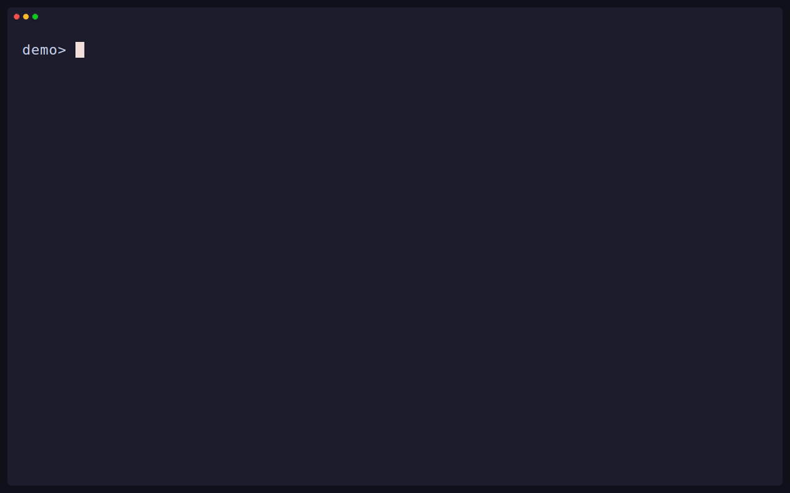

Intentional separates release intent from release state. Pending intent files
declare what should change. Annotated Git tags record what was released.
Manifests are format-preserving projections of that state, never competing
version authorities.

## Release units

A release unit is one logical thing that versions and releases together. It
may project that version into one manifest, several package ecosystems, or no
manifest at all. Each unit has exactly one primary tag, may have projection
tags for other distribution namespaces, and may depend on other units.

Projection modes describe where a computed version is materialized:

- `committed`: `apply` writes the release version to the manifest.
- `injected`: `stamp` writes an ephemeral build version.
- `none`: the version exists only in tags, as with Go modules.

A release unit without a version-bearing projection is tag-only. Named
workspace tags provide repository-level release records and continuous
delivery triggers without becoming version authority for a release unit.

## Verifiable release records

Every Intentional-created tag is annotated. Its record binds the release
interpretation contract, Intentional version, and canonical plan digest to the
target commit. Primary, projection, and workspace tags for one release agree
on the version, commit, contract, and digest.

Tags may require a `before-publication` or `after-publication` phase. A tag may
also declare another tag as a prerequisite. Intentional verifies those
conditions and computes a deterministic tag order; the surrounding release
harness decides when publication and other external effects occur.

Intentional never creates commits, pushes branches or tags, publishes to a
registry, opens pull requests, or operates a forge. `tag` is its only
Git-writing command. Tag templates do not add a `v` prefix.

## Supported ecosystems

Intentional discovers and projects versions across package formats without
reformatting unrelated content:

| Ecosystem | Adapter | Target |
| --- | --- | --- |
| npm | `npm` | `package.json` version field |
| Cargo | `cargo` | `Cargo.toml` package version |
| Pub | `pub` | `pubspec.yaml` version |
| PEP 621 | `python` | `pyproject.toml` project version |
| MSBuild | `msbuild` | `Version` property in project files |
| Go modules | `go` | Module version via tags only |
| Dev Container Features | `json` | `devcontainer-feature.json` version |
| Dev Container Templates | `json` | `devcontainer-template.json` version |
| JSON | `json` | Arbitrary field, format-preserving |
| TOML | `toml` | Arbitrary field, format-preserving |
| YAML | `yaml` | Arbitrary field, format-preserving |

Ecosystem adapters know their native version and dependency fields. Generic
`json`, `toml`, and `yaml` projections use an explicit pointer to an arbitrary
version field. Discovery proves only what manifest evidence supports; it does
not infer registries, publication policy, or repository-specific choreography.
