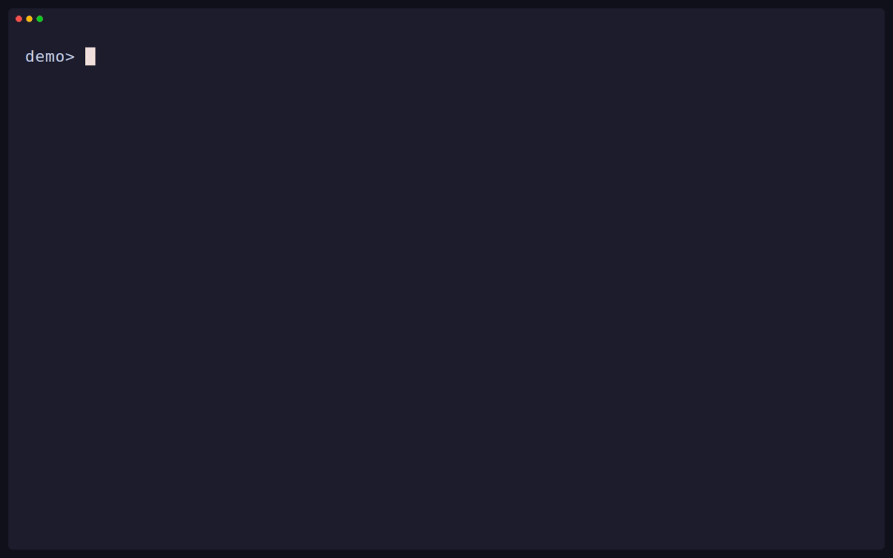

Toha generates projects and files from templates. A template asks questions,
then renders file paths and contents with Jinja. You can preview the plan before
Toha writes anything.



- Run the same interview from a terminal, a script, an agent, or the Rust crate.
- Resume an interview later, or supply answers from a JSON file.
- Render paths and files with typed Jinja values, conditions, and loops.
- Copy static files and generate one file for each item in a list.
- Run template hooks only when you trust the template.
- Use local folders or Git repositories, with short names and aliases for
  installed templates.
- Read the built-in agent guidance with `toha skills list` and
  `toha skills view`.

Choose an [installation method](/docs/toha/install), then try the demo below.

## Try a template

Toha ships a small demo template inside the binary. From any directory where
you want to create a note — offline, with nothing installed — preview what it
will make:

```sh
toha apply toha-demo ./notes --dry-run
```

Toha asks for **Note title** and **Topic**, then shows the planned file. When
you are ready to write it, run:

```sh
toha apply toha-demo ./notes
```

The dry run did not save answers, so answer the questions again. Toha writes
`notes/note.txt`. It leaves existing files unchanged unless you pass
`--force`. If a template has hooks, Toha shows them and requires trust before
running them. Use `--trust` for a template you know and trust for one run.

`toha-demo` is a reserved fallback name: if you install or alias a template as
`toha-demo`, that template resolves instead.

## Ask an agent to use a template

You can give an agent a short request and let it read the installed CLI help:

> Use Toha to generate files from the template I give you in the directory I
> choose. Start with `toha --help`, ask me for the template and target if I have
> not supplied them, and show me the planned changes before applying them.

Toha also carries agent guidance. Run `toha skills list` to find it and
`toha skills view <name>` to read a skill. To make your own template, read
[Authoring templates](/docs/toha/templates).
